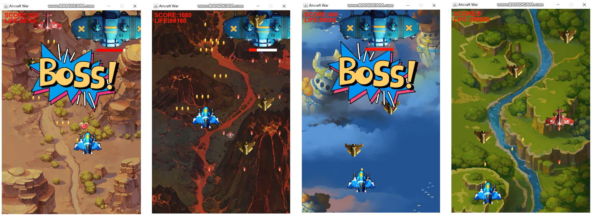
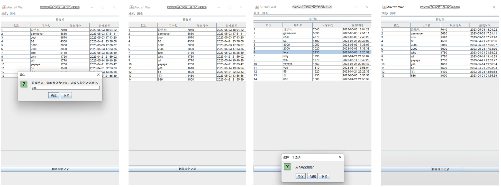

该项目为面向对象的软件构造导论的课程实验，以java实现。本 `README.md` 文件节选自结题报告

## 1 类的继承关系

*类图中需包括英雄机、所有敌机、道具、子弹及它们所继承的父类。*

## 2 设计模式应用

### 2.1 单例模式

在飞机大战游戏中，只有一个英雄机，因此适合使用单例模式来设计英雄机类。

### 2.2 工厂模式

在飞机大战游戏中，道具类和敌机类需要在程序中不断有新的实例，并且可能会有多个实例存在，因此适合使用工厂方法模式。

**道具类**

**敌机类**

### 2.3 策略模式

发射子弹的方式有直射和散射两种。精英敌机、英雄机和boss机都需要使用shoot方法来发射子弹，因此这里的应用场景需要使用策略模式来处理不同的发射子弹方式。

### 2.4 数据访问对象模式

使用DAO模式来管理用户数据，包括将游戏结束时的用户名、分数和游戏时间写入文件中以保存，以及从文件中读取所有用户的游戏信息并按照分数进行排名。

### 2.5 观察者模式

应用场景是炸弹道具的实现。当玩家获得炸弹道具时，需要消灭所有非boss敌机并获取相应的分数，同时让所有敌机的子弹消失。根据不同的对象写不同的update函数，如boss机只是减生命值，而其他敌机都被炸死，并且增加相应分数。

### 2.6 模板模式

在飞机大战游戏中，一个需要使用模板模式的应用场景是简单、普通、困难三个不同难度模式的实现。由于三个模式的实现逻辑基本相同，但部分内容有所区别，因此可以通过使用模板方法来实现代码的复用。

*子弹发射周期*

- 简单：英雄机更快 2:1 ，timeduration不变
- 普通：英雄机与敌机 1:1 ，基础timeduration不变
- 困难：英雄机与精英机1:1 ，timeduration越来越小，子弹越射越快 

*游戏界面中出现的敌机数量的最大值*

- 简单：4 
- 普通：5 
- 困难：6

*Boss敌机产生的得分阈值*

- 简单：/
- 普通：500分时第一次出现，随后出现周期500分
- 困难：400分时第一次出现，随后出现周期500分

*Boss敌机每次出现的血量、最大射击子弹数*

- 简单：/
- 普通：基础500，不加血
- 困难：基础500，出现一次+50

*Boss敌机每次出现的最大射击子弹数*

- 简单：/
- 普通：不变化
- 困难：每次出现都最大射击子弹数都＋1，最多是6

*敌机的属性值，如血量、速度、子弹数以及精英敌机的产生概率 POSIBILITY*

- 简单：无变化
- 普通：随着时间的增加乘倍率
- 困难：随着时间的增加乘倍率，时间间隔比普通模式更小，倍率增长更快

 

 

 ## 3 核心功能介绍

以下截图来自课程要求的游戏展示视频

**主菜单界面**

**游戏画面**

从左到右依次为困难模式、困难模式达到1000分后、普通模式和简单模式的游戏画面

**排行榜功能**

从左到右依次为输入名字、加入排名、确认删除排名、删除排名后
